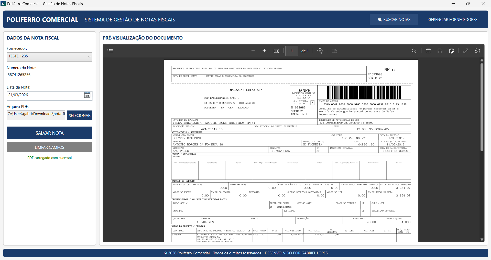
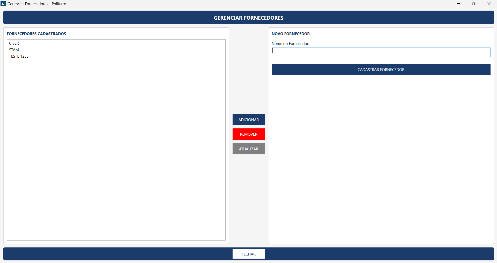
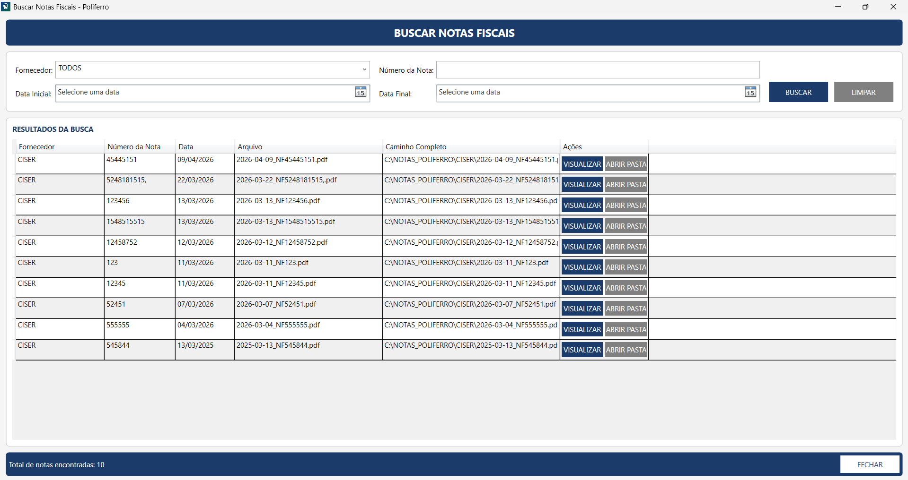

# 🧾 Sistema Poliferro - Gestão de Notas Fiscais

## 📌 Sobre o projeto

Sistema desenvolvido para a empresa **Poliferro Comercial** com o objetivo de gerenciar notas fiscais de forma digital, substituindo processos manuais e melhorando a organização.

---

## 📸 Telas do Sistema

### 🏠 Tela Principal

### 📝 Cadastro de Fornecedores

### 🔍 Busca de Notas

---

## 🚀 Funcionalidades

* Cadastro de fornecedores  
* Registro de notas fiscais  
* Visualização de PDF das notas  
* Controle interno de informações  

---

## 🛠️ Tecnologias utilizadas

* C#  
* WPF  
* .NET  
* WebView2  

---

## 💻 Como executar o projeto

1. Baixe o repositório  
2. Abra no Visual Studio  
3. Compile o projeto  
4. Execute o sistema  

---

## 📦 Instalação

O sistema possui instalador próprio:

* Execute o arquivo `InstaladorPoliferro.exe`  
* Siga os passos da instalação  

---

## ⚠️ Requisitos

* Windows 10 ou superior  
* WebView2 Runtime (instalado automaticamente)  

---

## 👨‍💻 Autor

Gabriel Lopes  
Desenvolvedor do sistema interno da Poliferro Comercial
